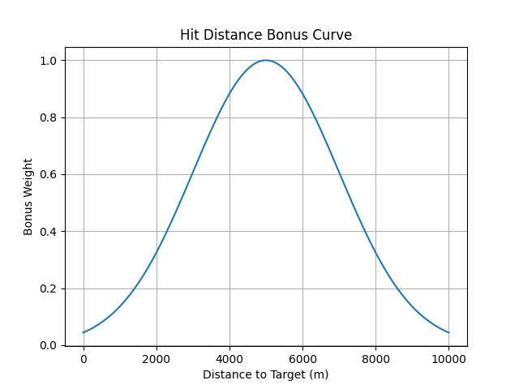

# train: shoot5
这必须得拿之前的再跑一次了，如果没问题我服了，72%的命中率？

# train: shoot imitation2
log: shoot_imi2.log  
render: shoot_imi2  
目前有点奇怪的点在于，命名看起来没学到东西，但不知道为什么命中率大幅提升了

前面四个shoot命中率大概是6%，20%， 20%， 18%  
而这次的命中还真高到47%了？  
用之前的躲弹dodge命中率有64%？最后100回合命中率72%  
这都怎么做到的？
命中率真提高了，提到了非常多？  

这就有点奇怪了，为什么命中率会提升呢？  

然后dodge的命中率大概是34% 31% dodge dodge2（纯规则）  

就很奇怪，明明也没有控制，还是上来就打弹，  
因此怀疑是躲弹的不行了，会不会是针对近距离躲弹导致过拟合，结果无法面对原来的打弹了？  
于是再次训练

# train: shoot imitation
log: shoot_imi.log  
render: shoot3 的后半部分，31号到1号
用从规则模仿学习到的智能体(ppo from .pt)去打用规则训练出来的智能体(dodge2)  
目前来看，模仿学习的效果不错，毕竟是完全按照复制来的，基本上是完全一样了，  
不过也是进不来，起码解决了发射难以学习的问题  
然后就是把模仿的智能体用来训练吧  
命中率47%  

目前的考虑：
+ 用最新的逃逸智能体
+ 打弹后没有奖励，只用最终打弹加入奖励
+ 前面就是对准和接近和高度和加速的奖励
+ 打弹时的奖励
+ 关键是看在训练后能不能稳定策略或者有更好的？
+ 不能出现打弹混乱
+ PPO自带线性头可能会有影响？不太清楚具体原理
+ 然后优化：
  + 考虑敌方姿态
  + 提高命中率？
  + 之前是30大概

## task 
设计了新的task  
singlecombat_task_imitation.py 中 SingleCombatShootMissileImitationTask  
动作空间是5维的-1到1的连续box  
然后要对动作进行处理，之后得到杆量和发射判断

敌方dodgemissileAgent，加入了序号，用dodge2

终止同HierarchicalSingleCombatShootMissile

奖励加入了速度，才发现posture是乘的关系  
其他同HierarchicalSingleCombatShootMissile  
而且都是发弹前才有，发弹后只有发弹奖励和击中奖励

# train: shoot missile 4
render shoot3 26号中午  
加入use-prior  
实在是没办法了  
希望这个会有更好的表现  
其实也有缺陷，很容易出现打弹重叠，不过这个应该目前不用担心
仍然很弱，决定使用模仿学习

# train:shoot missile 3
render shoot3 25号中午  
## 智能体
敌方dodge1 自己shoot2

## 奖励
+ 打弹scale放大为10
+ 姿态
  + 优势>对抗>找不到>劣势
  + 与双方都有关
+ 距离，远距离奖励急速下降，让飞机尽可能接近
+ scale下调 10
+ 最终打弹失败给-200

失败了，攻击学不到控制距离

# train: shoot missile 2
## 智能体
使用训练出来的躲避智能体

## 奖励
+ 打弹 shoot_penalty_reward.py
  + scale = 3
  + -20的防乱打
  + -10 的超过10000
  + 距离 * 10
    + 
    + center 7000 sigma 3000
    + 写在config里
  + 角度
    + 自己的
      + 超过50 -10
      + 50以内 函数 * 10
      + center 0 sigma 30
    + 敌方
      + 超过150 对着自己 +5
  + 高度
    + 0-2 给 0-1 * 5
+ 姿态：
  + 改成V3 自己写的函数
  * 分成均势，优势，劣势
  * 敌我机有没有进30度
  * 均势0-0.8，
  * 优势1-1.5
  * 劣势-1-0
+ 高度
  + relative_altitude_reward.py
  + 0-2 给 0-1
  + 直接不用他的v了

# train: shoot missile
train_shoot_missile.py

用sb3来训练  
## config: HierarchyVsBaseline_self.yaml
file path:  
render_path: "render_train/shoot"

A 1颗弹
B 无弹，使用dodge模型，想用自己的，但动作空间好像不对，
只能用它给的，结果全尼玛是问题  
给输出动作重新归一化，  
关键也不知道到底能力怎么样  
想调用自己的，但他搞得太乱了，调用非常麻烦，不用了

## 环境：singlecombat_env_shoot.py
step:加入render，render_path在config中

## 任务：
HierarchicalSingleCombatShootTask  
singlecombat_with_missle_task.py  
我不知道为什么它的step没有调用baseline  

## 奖励和终止条件
奖励增加了打弹间隔小于10 给-25的惩罚  
终止加了shoot_safe_return  

这怎么敌机这么抽象？

记录训练设置、结果和总结  
train_jsbsim.py 设置参数为下，
> 北纬1度大概为111公里，0.17度大概18.9公里  
> 北纬60度附近，经度差1度大约111.32×cos(60°)=111.32×0.5=55.66km  
> 南北纬度距离基本上不变，东西经度要看维度，因为有个cos  

## 发射规则 
shoot_flag = agent.is_alive   
np.sum(self.lock_duration[agent_id]) >= self.lock_duration[agent_id].maxlen：保持锁定超过1秒  
distance <= self.max_attack_distance：进入最大距离14000m  
self.remaining_missiles[agent_id] > 0：有弹  
shoot_interval >= self.min_attack_interval：距离上次发射间隔大于25s  

## 设置：
+ 似乎不需要从远方飞过来或者对准之类的
+ 直接打就完了
+ 随机方向，距离，高度，速度，
+ 记录：

1. 设置初始条件：在singlecombat_env.py中reset_simulator函数中实现
2. 自己的随机初始高度和速度吗？先不随机
3. 敌方距离在9000到14000米，朝向对准圆心，速度从400到1000英尺每秒
4. 在singlecombat_with_missile_task.py中修改了shoot_flag产生规则：
5. 自己存活且有弹就发射

奖励：
+ Posture_reward: 
  + range_reward: 
  + orientation: 视线角越小，奖励越大，敌方视线角小于pi/2，给负奖励，
+ missile_reward:
  + 奖励同向拉开，导弹降速就给奖励，降的越快给越多
  + 惩罚反向对冲，导弹降速就惩罚小一点
+ AltitudeReward 低于安全高度给负奖励，还向下飞就给速度的负奖励
+ event 被击中给-200的大惩罚
+ EndRelativeAltitude: 
  + 敌方导弹完成加速后，且速度低于1.2*150=180后
  + 或导弹飞行48秒后，即指导能力只有0.2后
  + 在simulator.py missile中加了一个导弹的能量耗尽标志函数

记录奖励曲线：
+ 修改了reward_function_base.py中的get_reward_trajectory函数
+ 将奖励曲线以json形式传回来了
+ ~~修改了env_base.py中step函数，在回合结束时调用get_reward_trajectory函数~~
+ ~~然后保存奖励曲线到~~
+ 不对，还是不能在env_base里保存，怎么想都不合适
+ 改为在每次eval时记录测试的结果
+ 然后还想把运行时所有的logging.info都存到文件里

+ train_jsbsim.py中添加了设置logging的函数，main函数会调用
+ 现在可以将info都保存到运行路径中的run.log里

+ 然后在jsbsim_runner中添加了保存reward_trajectory的
+ 现在每个episode测试都会把这个episode的reward_trajectory保存起来
+ 到运行路径中的reward_trajectory_x里

检查一下EndRelativeAltitude

## 在task_base中get_termination中添加了当done时，在info中添加了
info['success'] = success

+ 搞错了，经纬度还搞反了
+ 可以用render来测试

## 测试各个情况下危险程度
完成
dodge_missile_test.py  
调用singlecombat_env_test中SingleCombatEnvTest  
区别在于在init中加入了enemy_positions的字典数据列表，从外部对敌方进行初始化  
reset太坑了，每次step之后自动调用，还不能加输入  
所以提前全部输进去，自己遍历  
等训练完就可以测试，估计要测很久

reset 返回值：ndarray(1,1,21)

## 躲弹结束回合标志
只要敌方弹全部失效，而且自己存活，无论敌方死活，dodgemissile safe return 回true  
然后回进env_base 的step  
最后进了个_pack，对done这种大小只有1的数据只取自己的，因此A结束，回合结束  
设置的确实牛逼  
现在问题是状态没了，回合一结束肯定是reset了  
保存上个回合的状态  
然后是每个回合仿真完就保存result 和数据
为什么这么多302？为什么会有2？
2的原因是上来就失速了，因为最低是150米每秒，也就是490英尺每秒  
render一下看看  

render有个标志位self._create_records = False  
因为之前没有reset，结果导致每次新回合的render都有问题，现在把重置加到了reset里

## 尝试多环境测试，随机初始条件，不然太慢了
在singlecombat_env_test.py中修改新的step

## 参数：
--env-name
SingleCombat
--algorithm-name
ppo
--scenario-name
1v1/ShootMissile/HierarchySelfplay
--experiment-name
v1
--seed
1
--n-training-threads
1
--n-rollout-threads
32
--cuda
--log-interval
1
--save-interval
1
--use-selfplay
--selfplay-algorithm
fsp
--n-choose-opponents
1
--use-eval
--n-eval-rollout-threads
1
--eval-interval
1
--eval-episodes
1
--num-mini-batch
5
--buffer-size
3000
--num-env-steps
1e8
--lr
3e-4
--gamma
0.99
--ppo-epoch
4
--clip-params
0.2
--max-grad-norm
2
--entropy-coef
1e-3
--hidden-size
128
128
--act-hidden-size
128
128
--recurrent-hidden-size
128
--recurrent-hidden-layers
1
--data-chunk-length
8
--use-prior